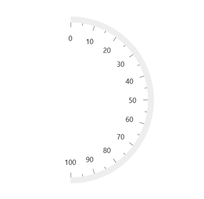
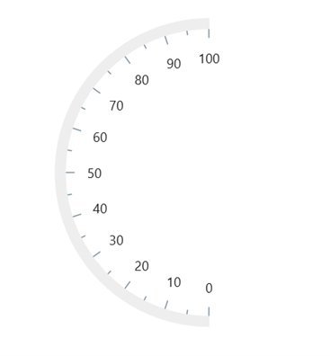
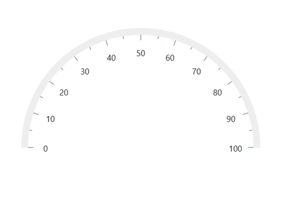
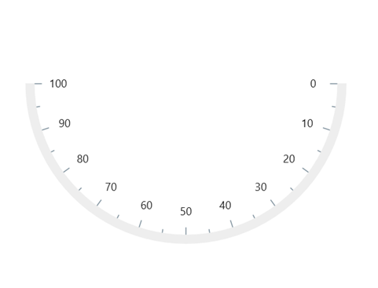

# How-to-create-the-various-directional-semi-circular-gauge-using-the-.NET-MAUI-Radial-Gauge
This article describes how to create the various directional semi-circular gauge using the [Syncfusion .NET MAUI Radial Gauge](https://www.syncfusion.com/maui-controls/maui-radial-gauge) control.

You can create the semi-circular gauge by varying the [StartAngle](https://help.syncfusion.com/cr/maui/Syncfusion.Maui.Gauges.RadialAxis.html#Syncfusion_Maui_Gauges_RadialAxis_StartAngle) and [EndAngle](https://help.syncfusion.com/cr/maui/Syncfusion.Maui.Gauges.RadialAxis.html#Syncfusion_Maui_Gauges_RadialAxis_EndAngle) property of [RadialAxis](https://help.syncfusion.com/cr/maui/Syncfusion.Maui.Gauges.RadialAxis.html).

Create the [SfRadialGauge](https://help.syncfusion.com/cr/maui/Syncfusion.Maui.Gauges.SfRadialGauge.html) control by referring to this getting started [link](https://help.syncfusion.com/maui/radialgauge/getting-started#creating-an-application-using-the-net-maui-radial-gauge) and add an axis into it.

**East directional gauge:** Set the start angle property value as 270 and the end angle property value as 90 to show the east direction semi-circular gauge.

[XAML]
```
<gauge:SfRadialGauge>
    <gauge:SfRadialGauge.Axes>
        <gauge:RadialAxis StartAngle="270"
                          EndAngle="90"
                          Interval="10">
        </gauge:RadialAxis>
    </gauge:SfRadialGauge.Axes>
</gauge:SfRadialGauge>
```

[Output]



**West directional gauge:** Set the start angle property value as 90, end angle property value as 270, and IsInversed property value as true to show the west directional semi-circular gauge.

[XAML]
```
<gauge:SfRadialGauge>
    <gauge:SfRadialGauge.Axes>
        <gauge:RadialAxis StartAngle="90"
                          EndAngle="270"
                          Interval="10">
        </gauge:RadialAxis>
    </gauge:SfRadialGauge.Axes>
</gauge:SfRadialGauge>
```

[Output]



**North directional gauge:** Set the start angle property value as 180 and the end angle property value as 0 to show the north directional semi-circular gauge.

[XAML]
```
<gauge:SfRadialGauge>
    <gauge:SfRadialGauge.Axes>
        <gauge:RadialAxis StartAngle="180"
                          EndAngle="0"
                          Interval="10">
        </gauge:RadialAxis>
    </gauge:SfRadialGauge.Axes>
</gauge:SfRadialGauge>
```

[Output]



**South directional gauge:** Set the start angle property value as 0, end angle property value as 180, and IsInversed property value as true to show the south directional semi-circular gauge.

[XAML]
```
<gauge:SfRadialGauge>
    <gauge:SfRadialGauge.Axes>
        <gauge:RadialAxis StartAngle="0"
                          EndAngle="180"
                          Interval="10">
        </gauge:RadialAxis>
    </gauge:SfRadialGauge.Axes>
</gauge:SfRadialGauge>
```

[Output]



## See also

[How to create an application using the .NET MAUI Radial Gauge?](https://help.syncfusion.com/maui/radialgauge/getting-started#creating-an-application-using-the-net-maui-radial-gauge)

[How to customize scale?](https://help.syncfusion.com/maui/radialgauge/axes#custom-scale-range)

[How to customize Axis?](https://help.syncfusion.com/maui/radialgauge/axes#axis-customization)

[How to customize Axis Angle?](http://helpstaging.syncfusion.com:14038/maui/radial-gauge/axes#angle-customization)

[How to customize Axis Label?](https://help.syncfusion.com/maui/radialgauge/axes?cs-save-lang=1&cs-lang=csharp#axis-label-customization)

[How to customize Axis Label using Label Created Event?](https://help.syncfusion.com/maui/radialgauge/axes?cs-save-lang=1&cs-lang=csharp#labelcreated)
